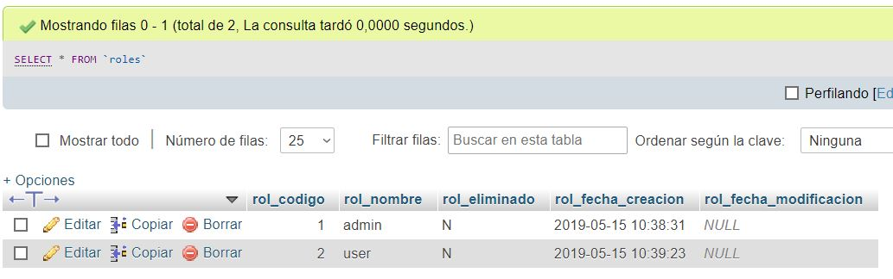

#Con base al archivo Práctica 04 – Creación de una aplicación web usando PHP y Base de Datos, se pide realizar los siguientes ajustes: 
	-a) Agregar roles a la tabla usuario. Un usuario puede tener un rol de “admin” o “user” 
	-b) Los usuarios con rol de “admin” pueden únicamente: modificar, eliminar y cambiar la contraseña de cualquier usuario de la base de datos. 
	-c) Los usuarios con rol de “user” pueden modificar, eliminar y cambiar la contraseña de su usuario. 

Para este punto se procedió a crear una tabla para controlar los roles, y una clave foránea en la tabla users de esta manera se puede gestionar si el usuario de la BD es admin o user.

Luego, con base a estos ajustes realizados, se pide desarrollar una aplicación web usando PHP y Base de Datos que permita gestionar (enviar y recibir) mensajes electrónicos entre usuarios de la aplicación. De los mensajes electrónicos se desea conocer la fecha y hora, remitente, destinatario, asunto y mensaje. Para lo cuál, se pide como mínimo los siguientes requerimientos: 

 

Usuario con rol de user: 
	d) Visualizar en su pagina principal (index.php) el listado de todos los mensajes electrónicos recibidos, ordenados por los más recientes. 
	 
	e) Visualizar el listado de todos los mensajes electrónicos enviados, ordenados por los más recientes. 
	 
	f) Enviar mensajes electrónicos a otros usuarios de la aplicación web. 
	 
	g) Buscar todos los mensajes electrónicos recibidos. La búsqueda se realizará por el correo del usuario remitente y se deberá aplicar Ajax para la búsqueda. 
	 
	h) Buscar todos los mensajes electrónicos enviados. La búsqueda se realizará por el correo del usuario destinatario y se deberá aplicar Ajax para la búsqueda. 
	 
	i) Modificar los datos del usuario. 
	 
	j) Cambiar la contraseña del usuario. 
	 
	k) Agregar un avatar (fotografía) a la cuenta del usuario. 
	 

Usuario con rol de admin: 
	l) No puede recibir ni enviar mensajes electrónicos. 
	m) Visualizar en su pagina principal (index.php) el listado de todos los mensajes electrónicos, ordenados por los más recientes. 
	 
	n) Eliminar los mensajes electrónicos de los usuarios con rol “user”. 
	 
	o) Eliminar, modificar y cambiar contraseña de los usuarios con rol “user”. 
	 

Por último, se debe aplicar parámetros de seguridad a través del uso de sesiones. Para lo cuál, se debe tener en cuenta: 
	p) Un usuario “anónimo”, es decir, un usuario que no ha iniciado sesión puede acceder únicamente a los archivos de la carpeta pública. 
	q) Un usuario con rol de “admin” puede acceder únicamente a los archivos de la carpeta admin → vista → admin y admin → controladores → admin 
	r) Un usuario con rol de “user” puede acceder únicamente a los archivos de la carpeta admin → vista → user y admin → controladores → user 

Diagrama E-R

 
Nombre de la BD: hip

Sentencias SQL de la estructura de la BD
CREATE TABLE `roles` (
`rol_codigo` int(11) NOT NULL AUTO_INCREMENT,
`rol_nombre` varchar(10) NOT NULL,
`rol_eliminado` varchar(1) NOT NULL,
`rol_fecha_creacion` timestamp NOT NULL DEFAULT CURRENT_TIMESTAMP,
`rol_fecha_modificacion` timestamp NULL DEFAULT NULL,
PRIMARY KEY (`rol_codigo`)
) ENGINE=InnoDB DEFAULT CHARSET=utf8 AUTO_INCREMENT=1 ;

CREATE TABLE `usuario` (
`usu_codigo` int(11) NOT NULL AUTO_INCREMENT,
`usu_cedula` varchar(10) NOT NULL,
`usu_nombres` varchar(50) NOT NULL,
`usu_apellidos` varchar(50) NOT NULL,
`usu_direccion` varchar(75) NOT NULL,
`usu_telefono` varchar(50) NOT NULL,
`usu_correo` varchar(20) NOT NULL,
`usu_password` varchar(255) NOT NULL,
`usu_fecha_nacimiento` date NOT NULL,
`usu_eliminado` varchar(1) NOT NULL DEFAULT 'N',
`usu_fecha_creacion` timestamp NOT NULL DEFAULT CURRENT_TIMESTAMP,
`usu_fecha_modificacion` timestamp NULL DEFAULT NULL,
`rol_usu_codigo` int(11) NOT NULL,
`usu_imagen` longblob NULL DEFAULT NULL,
PRIMARY KEY (`usu_codigo`),
UNIQUE KEY `usu_cedula` (`usu_cedula`),
FOREIGN KEY (`rol_usu_codigo`) REFERENCES roles(rol_codigo)
) ENGINE=InnoDB DEFAULT CHARSET=utf8 AUTO_INCREMENT=1 ;

CREATE TABLE `correo` (
`cor_codigo` int(11) NOT NULL AUTO_INCREMENT,
`cor_usu_remite` int(11) NOT NULL,
`cor_usu_destino` int(11) NOT NULL,
`cor_asunto` varchar(200) NOT NULL,
`cor_mensaje` varchar(1000) NOT NULL,
`cor_fecha_envio` timestamp NOT NULL DEFAULT CURRENT_TIMESTAMP,
`cor_eliminado` varchar(1) NOT NULL DEFAULT 'N',
`cor_elimina` int(11) NULL DEFAULT NULL,
`cor_fecha_elimina` timestamp NULL DEFAULT NULL,
PRIMARY KEY (`cor_codigo`),
FOREIGN KEY (`cor_usu_remite`) REFERENCES usuario(usu_codigo)
) ENGINE=InnoDB DEFAULT CHARSET=utf8 AUTO_INCREMENT=1 ;

GitHub
Usuario: damoralesr97
URL: https://github.com/damoralesr97/AppWebPhpBD
